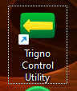
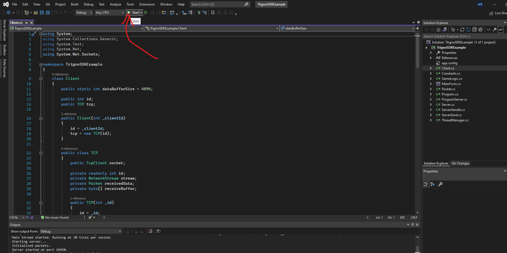
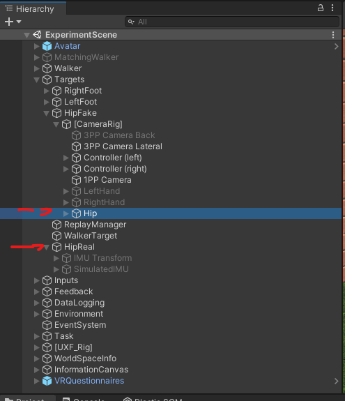
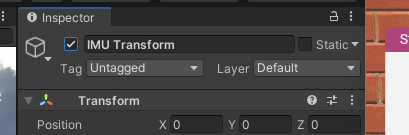

# Protocol

## KEYPRESSES

- F9: Previous Trial
- F10: Restart Trial
- F11: Stop current trial (next trial)
- R: Connect to IMU
- Y: ReConnect to IMU
- F2: Calibrate IMU

## Needed materials

- 2x printed informed consent forms
- right VR controller
- VR HMD
- 2 trackers
- Add tracker to walker
- Add tracker to waistband
- EMG system (Delsys)

## Steps preparation

### Set up EMG IMU

1. Power EMG and put in USB

2. Open Trigno Control Utility (shortcut on desktop)  

3. Take out 1 sensor, find the sensor number on the sensor

4. Click pair for that sensor in Trigno Control Utility  & touch the wifi icon in the EMG box until it blinks green fast 3 times (sensor should then pair and green light will blink slowly),

> sometimes you need to re-insert it into its charging slot, before touching the wifi-icon.

5. Slide tracker into waistband (arrow pointing in, emg electrodes down).

6. Open TrignoSDKExample.exe (or in windows menu, or: Start Visual Studio 2022, open project TrignoSDKExample and click start) 
   

> TODO: LINK TO DOWNLOAD
7. Click Start in the top of the window
8. A new GUI opens. Click connect,  set the Sensor number, and click start, after a couple of seconds, sensor values should appear in the GUI.

### Set up SteamVR

    1. Connect HMD cables

2. Connect (right) VR controller

3. Connect 2 trackers

4. Attach tracker to waistband LED pointing towards UnboundVR logo), and walker (doesn't matter, but make sure the strap is in the middle)

5. Do VR Room Setup

    - Standing Only

    - Place hmd on middle of balance board "looking at" the walker

    - Floor height is balance board

### Set up unity scene - `UpperLimbTracking`

1. Open project

2. **Edit tracker numbers** (`Targets/HipFake/[CameraRig]/Hip`, `Targets/HipReal` and `Targets/WalkerTarget`)

After, Look at Configured Name on the tab on the inspector window of Unity and change the name of the Tracker from `tracker1` to any other number of the new tracker (e.g. `tracker2`), these names are defined in `StreamingAssets/tracker_config.txt` 
   

3. Calibrate and setup IMU from EMG system

    1. Enable `Targets/HipReal/IMUTransform GameObject` 
   

    2. Start Scene

    3. Connect the IMU to Unity (press R )

        - If you need to reconnect: **Y** - ReConnect to IMU

        - double click on the `Targets/HipReal/IMUTransform`

    4. Calibrate IMU orientation (**F2**) repeatedly on different sides, wait to stabilize after each rotation, stop when values from two orthogonal sides change less than *5* deg.

        - to do so, first click with the left button of the mouse on the game scene and press **F2**

    5. Copy transform of IMUTransform, stop scene, paste transform values.

    6. Disable `Targets/HipReal/IMUTransform` GameObject

4. Test some steps (with SIMPLE config)

## Troubleshooting

- If the TrignoSDKExample shuts down instantly, likely another instance of the process is running in the background. CTRL+SHIFT+ESC to open tskmgr, and shut the process down, then restart.
- IMU doesn’t calibrate but just keeps jumping with large values. Probably, the tracker isn’t connected properly, double check that.
- **Scene crashed, and has to be restarted**
    - Back up the data that was collected so far.
    - Make sure you edit the starting trial in the config JSON (starts at 0).
- Scene is still running, but **IMU sensor crashed**
    - Shut down the TrignoSDKExample program from task manager
    - Restart it
    - Reconnect using Y

## Steps

1. Sign informed consent

2. Ask them if possible to put their phone on silent mode (to avoid distractions)

3. Show presentation 1

    - Calibration

4. Questions about the experiment

5. Fill in demographics in Unity

6. They put on headset & hip tracker

7. Second calibration

8. Familiarization phase

    - Ask these questions: **make sure they understand everything**
        1. Ask which is the front leg
        2. Ask if they are acceleration forward
        3. Ask about minimization of forward lean / trunk inclination
    - They can ask questions
    - Ask if they have further questions
    - Ask if they are ready, if yes, go to next step

9. Baseline test

    - Tell them they can no longer ask questions (before starting)

10. Come back to computer for NASA TLX questionnaire

11. **IF** condition with visual cues (condition 1 or 2 / VF or VT)
    - **THEN** Show presentation 2
        1. Ask them if they have any questions
        2. Aks them to explain the visual cue (correct if necessary)

12. They go back to test area
    - Tell them they will have 5 tests of 2 minutes
    - Tell them they are allowed to ask questions

13. Recalibrate

14. They perform the training 5 times
    - In between, we ask them to remove the headset
    - They can resume once they feel freshly rested, ask them about this
    - Every time they step back up, recalibrate

15. Come back to computer for Questionnaires:
    - NASA TLX
    - SUS
    - Embodiment
    - SSQ

16. Tell them to rest if needed

17. They go back to test area

18. Recalibrate

19. New familiarization phase

    - Tell them they can ask questions

    - They rest as long as needed

20. Recalibrate

21. Final Test

    - Tell them they can NOT ask questions

22. Come back to computer for **NASA TLX** questionnaire

## Restart the experiment

If a restart is needed, be very careful, or you might mess up the data and have to throw out this participant.

### Gather information
Find out some information we need to input into our settings file, find them and write them down.

1. Task/CalibrationManager → VRIK Calibration Controller → Avatar Scale.

    - Trial no (bottom of game window, or under [UXF Rig] → Session, bottom slider).

    - Which questionnaire they’re on.

        1. Beginning: 0

        2. After Familiarization: 1

        3. After training: 5

### Restarting the scene
1. Ask participant to take a Break and step down the platform, after removing the HMD
> If you changed devices in between the restart (say one of the trackers ran out of battery), make sure you edit the tracker numbers, as explained above
2. On UNITY:

    - On the game window, look at the bottom part and TAKE NOTE of the TRIAL in which the experiment failed (there are 14 trials in total)

    - Go to: `Task/CalibrationManager → VRIK Calibration Controller → Avatar Scale`  = Copy&Paste the Avatar scale Value on a .txt file or write it down

    - STOP SCENE

3. Open `FILE EXPLORER → Downloads → … = BACKUP` folder containing the data collected so far, and RENAME the folder, such as 20_BackUP_T4

4. On WINDOWS:

    - open TASK MANAGER and END TASK for TRIGNOsoftware (IMU)

5. On UNITY:

    - `Task/CalibrationManager → VRIK Calibration Controller → Avatar Scale` = Copy&Paste Avatar scale value

    - On the game window, fill in information = Participant Number + Session (n+1) + Age

6. On WINDOWS:

    - open TRIGNOsoftware = Connect and Start IMU

7. On UNITY:

    - On the game window:

1. Connect IMU = click with your mouse on the screen → Press R to relaunch IMU → Check if IMU is connected on UNITY main UI

8. Ask participant to wear the HDM and step up the platform

9. On UNITY:

    - On the game window:
        1. Calibrate

        2. Press Start session

        3. Press F11 until you reach the TRIAL **before** the game crashed

        4. Press Start TRIAL

